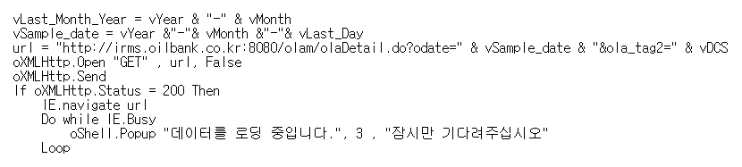
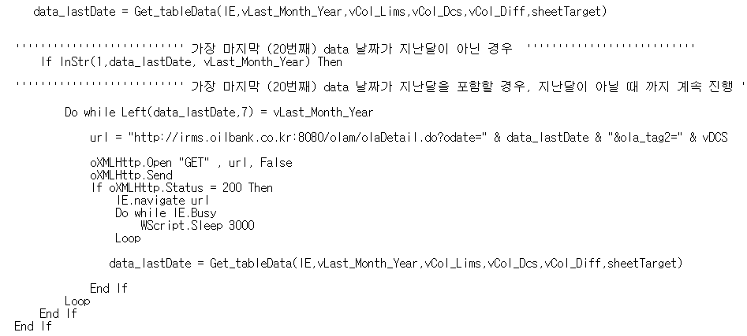
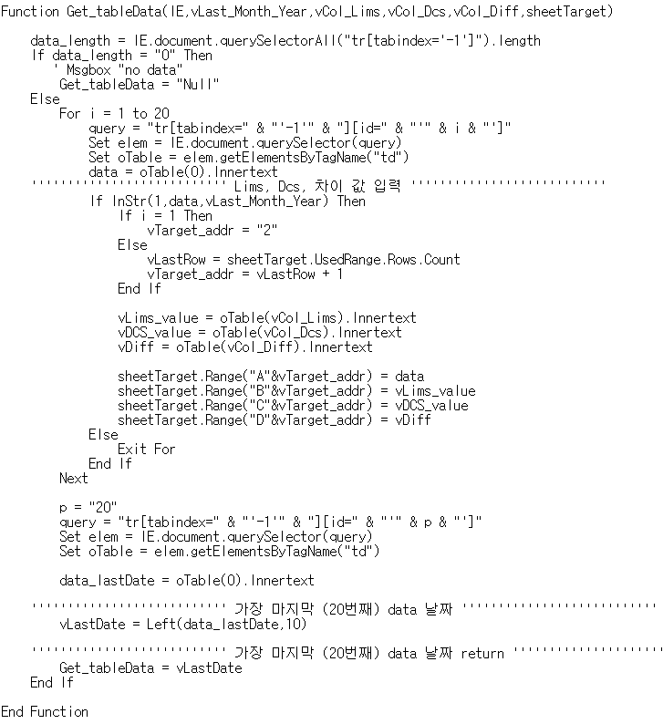
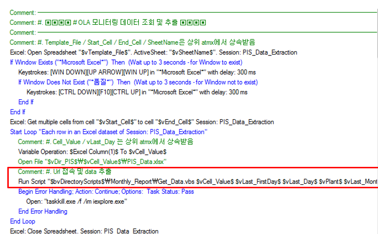

# VBscript Code {#intro}

* RPA Solution과 VBScript를 조합하여 업무자동화의 효율성을 증진 

* 본 업무에 사용한 VBScript code를 간략하게 소개


## VBScript code review_01


### HTTP 통신 및 url 접속 

{width=100%,height=100%}

```
* Data 위치한 경로에 HTTP 통신 
* status가 200이면 정상이므로 url로 접속 
* Data가 완전히 loading 될 때까지 delay 설정

```


### Data 추출  


{width=100%,height=100%}

```
* Get_tableData 라는 function 실행 ( 해당 function에 대해서는 추후 설명)
* script 실행날짜 기준으로, 전월날짜인 Data만 추출 
* 만약 2달전 날짜이면 url close 

```


### Get_tableData 함수 


{width=100%,height=100%}

```
* querySelectorAll 함수를 이용하여 query 작성
* Data table의 값들을 가져와서 전월 날짜의 Data이면 Excel 파일에 입력 
* 총 20개의 index가 존재하며, for 구문으로 Data 추출 및 입력 
```


### RPA Solution과 Script 조합 


{width=100%,height=100%}

```
* 빨간박스 내부의 script가 바로 위에서 설명한 script 실행하는 로직 
* Data 조회에 필요한 primary key를 Excel template 파일에서 가져온 뒤 그 값을 Script에 input 변수로 제공 
* 모든 primary key에 대해 loop 문 실행 
```


