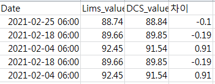
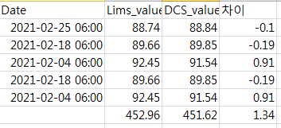
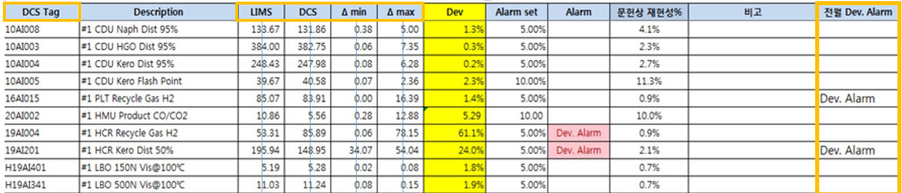

--- 
title: "RPA TASK 월간보고서 작성"
author: "윤창식"
date: "2021-02-19"
site: bookdown::bookdown_site
documentclass: book
bibliography: [book.bib, packages.bib]
biblio-style: apalike
link-citations: yes
description: " RPA 업무 소개 02 "
---

# Introduction

**월간보고서작성** 업무의 일부 Flow에 대해 소개하고자 한다.  
  1) **특정 URL**에 접근하여 `Data crawling`  
  2) 추출한 Data의 통계량 계산 및 Template파일에 `Mapping`
 

## Task Flow

### Url 접속 

{width=0.5%,height=0.5%}

```
주어진 Primary key에 대해, data table이 존재하는 url로 접속  

```


### Data 추출  

{width=0.5%,height=0.5%}

```
업무 시행일로부터 한달 전 날짜인 데이터만 추출 / 필요한 column만 추출 

```


### 통계량 계산  

{width=0.5%,height=0.5%}

```
각 column별 합을 구한 뒤 산술평균값을 계산 

```

### Template 파일에 Data Mapping


{width=0.5%,height=0.5%}

```
계산한 평균값을 각 Primary key에 맞추어 Template 파일에 mapping한다. 

```


```{r include=FALSE}
# automatically create a bib database for R packages
knitr::write_bib(c(
  .packages(), 'bookdown', 'knitr', 'rmarkdown'
), 'packages.bib')
```
